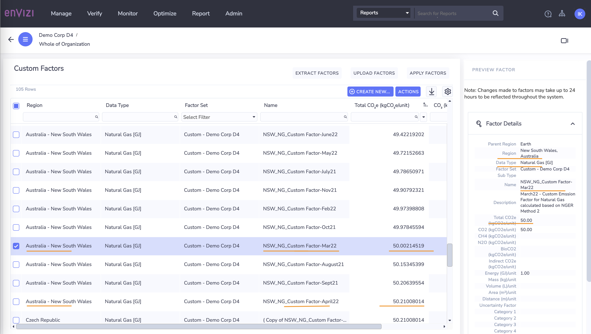
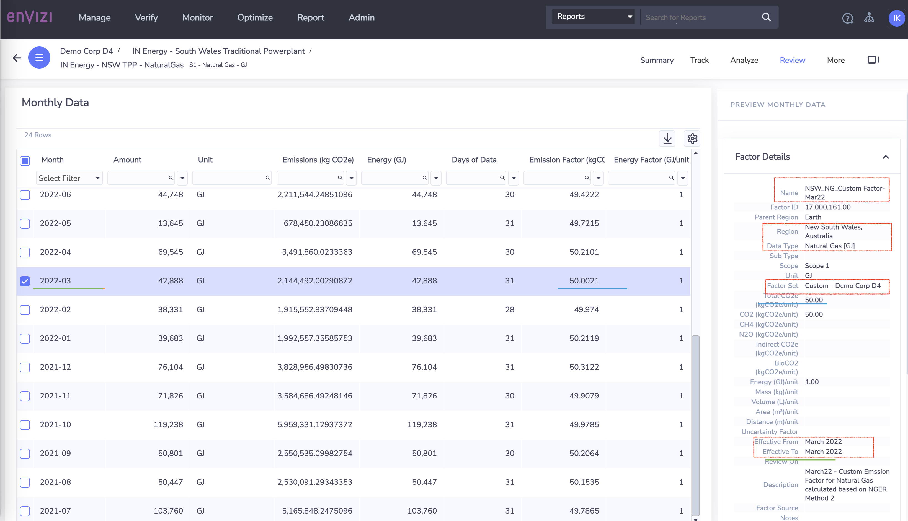
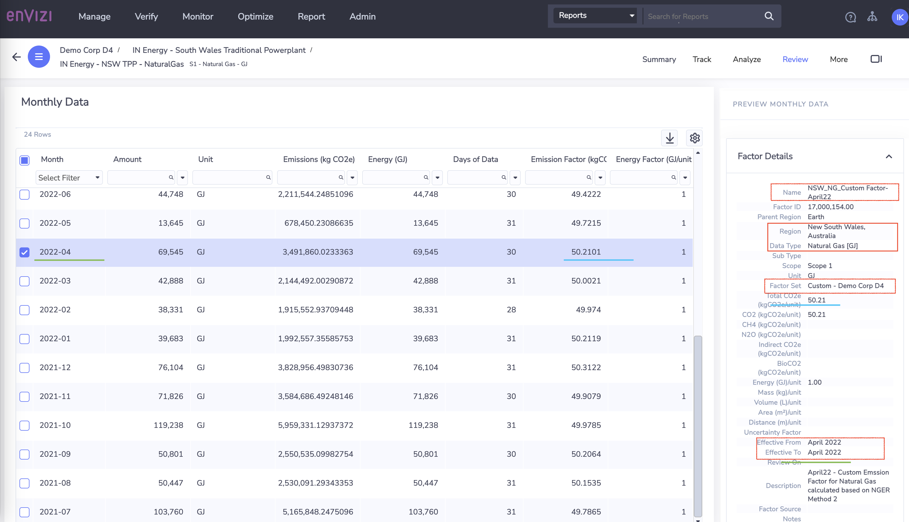

# Emission Factor Management in IBM Envizi

## Objective
The objective of this article is to help understand how Envizi manages the Emission factors  

## What are Emission Factors and why those are important

When Organization started their Sustainability journey, the very crucial thing is to start capturing the relavant data with respect to their operations to estimate / calculate the emissions. The captured data should be cleaned, normalized and then used to calculate the organization emissions. So to calculate emissions, two types of input data is required. 

#### 1. Activity data
Activity data is a quantitative measure of a level of activity that results in GHG emissions. This is the data the organization captures from their operations / supplychain,etc.

Example :
- How many liters of fuel consumed, 
- How much electricity is consumed, 
- How many kilograms of material purchased

#### 2. Emission factor
An Emission factor is a factor that converts activity data into GHG emissions data.
Example :
- How much kg CO2 is emitted per liter of fuel consumed
- How much kg CO2 is emitted for one kwh power consumption 
- How much kg CO2 is emitted per kilograms of material produced

In otherwords, emission factors helps organizations to calculate the emissions or co2 equivalent of Greenhouse gases which are emitted because of the activities performed by their business. 

## Who developes the Emissions Factors 

The Governments, environmental agencies, organizations, research insitutes publishes the emission factors for numerous activity based data,  based on the scientific studies and experiements conducted considering various parameters, conditions, states , regions , etc

Below are the some of the well known emission factor sets published by various organizations and countries. 

- ***International Energy Agency (IEA)*** publishes a comprehensive set of  Electricity and Heating emission factors annually covering most countries and regions in the world. Hence this emission factor set is leverage globally when the country or region specific emission factors are not available.  [more info](https://www.google.com/)

- ***Environmental Protetction Agency (EPA)*** of United States, publishes emission factors for  electricity purchased from eGRID, mobile combustion, upstream and downstream transportation, business travel, product transport, and employee commuting.   [more info](https://www.google.com/)

- ***Department for the Environment, Food and Rural Affairs (DEFRA)*** and the UK Government publishes a comprehensive set of  GHG emission factors covering Scope 1, 2 and some Scope 3 emission sources. Mainly applies to UK, however company across Europe use this factor set.  [more info](https://www.google.com/)

- ***New Zealand Ministry for the Environment*** publishes GHG emission factors covering Scope 1, 2 and some Scope 3 emission sources.  [more info](https://www.google.com/)

- ***The Australian Government*** publishes GHG emission factors covering Scope 1, 2 data sources. [more info](https://www.google.com/)

- ***Eora’s MRIO (Multi-region input-output)*** provides spend-based emission factor set across 66 industry sectors, which is gloabally recognized.  [more info](https://www.google.com/)

## What are the Supported Emissions Factors in Envizi ?

Envizi manages all publicly available emission factors which includes IEA, Eora66, US eGRID, UK Defra, NGRES, USEEIO

As of date Nov 2023,  below are the Emission factors managed by Envizi

#### Factor Set
<table>
    <tr>
        <th width="20%">Region Type</th>
        <th width="20%">Region</th>
        <th width="15%">Factor Set</th>
        <th width="25%">Supported Activities</th>
    </tr>
    <tr>
        <td>Global</td>
        <td>Global</td>
        <td>

[IEA...](https://knowledgebase.envizi.com/home/managed-emission-factors-iea)
        </td>
        <td>Scope 1 2</td>
    </tr>   
    <tr>
        <td>Global2</td>
        <td>Global2</td>
        <td>

[IEA...1111](https://knowledgebase.envizi.com/home/managed-emission-factors-iea)
        </td>
        <td>Scope 1 22222</td>
    </tr>   
</table>

## How Emissions Factors are applied in Envizi ?

As we learnt in the begining of the article, emissions are calculated for a given activity data  by applying the corresponding emission factor.  

### Typical Emissions Factor selection process 

Lets say, an organization in United States  purchases electricity from a electricity grid for their day to day operations. So here, `activity data = the electricity consumed` 

Now, how do we find which emission factor to apply on  this activity data(consumed electricity) to calculate the emissions?

Typically below steps are followed :

1. Check if Emission factors are provided by Supplier / Provider
2. If not,  look for available emission factors published for the regions, country, continent and global in sequence. 
        

When the organization has operations spread across multiple regions / continents, it will be quite tedious and error prone process to find the applicable emission factor. And also, the organization may have other crieterias to consider like whether to apply the factor based on factor publishing date or effective date. 

### Factor Selection Algorithm in Envizi

Envizi brings the value by automating the process to find the appropriate factor based by applying the Factor Selection Algorithm (FSA).  

How does the Factor Set Algorithm (FSA) works? 

Assuming the data is loaded into Accounts / meters and normalized as Monthly data, Envizi apply the factor selection algorithm (FSA), which basically filerts through the all available factors based on the following  five criterias: 
    
- **Data type** : The type of activity data such as Electricity, Natural Gas, etc.
- **Sub type** : Sub categorization similar to data type to link factors to accounts
- **Factor Set** : Collection of emission factors 
- **Region** : The region where the emission factor is applicable. 4 levels are considered (city, state, country, global)
- **Effective and Published Dates**: Organizations can apply factors by effective or published dates, depending on preference

Here is the pictorial representation of the same process.

   

### Factor Selection Algorithm with Example

Now, Lets look at how Emission factors are applied by Envizi for same account associated with different locations and date

We have 3 examples below and we are using the same `Account` and `Data type`.
- Account - ELEC_VEEE1697
- Data type - Electricity

#### Example 1
- Location -  `NewYork, US`
- Date of Activity - Oct,2023
- Applied Factor - eGrid-2023
- Effective from - Jan 2021

    

#### Example 2
- Location -  `London Center, UK`
- Date of Activity - `Dec, 2022 `
- Applied Factor - Managed DEFRA
- Effective from - Jan 2022

    

Between example 1 and 2 the locations are different so the emission factor applied is based on the Location.

#### Example 3

- Location -  London Center, UK
- Date of Activity - `July, 2023`
- Applied Factor - Managed DEFRA
- Effective from - Jan 2023

    

- Between example 2 and 3 the `Locations` are same but `Date of Activity` is different. 
- Being the locations are same `DEFRA` Emission factor is applied for both.
- But versions of the `DEFRA` Emission factor is different because the `Date of Activity` is different.
- For example 2, `DEFRA-2022` factorset is applied because it is effective from `Jan 2022 - Dec 2022`.
- For example 3, `DEFRA-2023` factorset is applied which is effective from `Jan 2023`.
- You can also look at Total CO2e and Facotor source values from the screenshot. 

### Factors publishing dates

For keeping things easier and simpler, so far we only talk about Factor Effective dates, not publishing dates. To learn more on effective and published date logic works together in Envizi, please refer https://knowledgebase.envizi.com/home/factor-published-date-logic

## How does these Emission Factor Sets are maintained in Envizi ?

Envizi product team follow the below steps to ensure factor appropriateness and correctness.

- most current and up-to-date factors are available in the system 
- ensure the data integrity by conducting  regular audits and reviews. 
- Set review dates for all factors which will be updating frequently
- make sure no factor conflicts arises as the factor sets are being updated
- create special list of factors based on the organization request
- conducts variance analysis on factors which helps to find the factors exists outside the thresholds of datatypes. 

  

# Custom Emission Factors

Envizi provides the standard set of emission factors with the platform. However, if your organization have defined custom emission factors, Envizi allows you to create the same in the platform. Once created, these custom factors are selected in preference to Envizi's default set of managed factors.

To create new Custom Factor in Envizi, navigate to  Admin -> Configuration -> Custom Factors. 
Provide the inputs for the below parameters.
- Region : Provide the City / state / region for which the Cusom factor should be applied
- Data Type : Chose the data type from the list
- Factor Set : Go with default. Nothing to update
- Name : Provide a unique name to represent the custom factor
- Total CO2e : Provide the emissions in CO2e 
- Effective from : Date from when this custom factor is applied
- Effective to : End date for the custom factor to be applied

    

Once created, you can view the Custom Emission Factors from the same page as Admin -> Configuration -> Custom Factors. 
    
Here is example of custom factors created in the system. In the below screenshot, you can see  custom factors created for each month for the same region and data type.

    

Now, lets have a look at how these factors applied in Envizi. The custom factor would be applied to an Account with data type : Natural Gas associaed with the Location : New South Wales, Australia.   

Below is the screenshot of the account's monthly data summary.   For the Month of March22, the custom factor set NSW_NG_Custom Factor-March22 is applied. You can also note the effective dates.

  

Next, look at another montly data record, where you can see a different custom factor is applied. 
Envizi-CF-NSW-March22

  

## Summary
    
In this artilce, we have discussed about the emission factors, what are the well known emission factor sets available in public. We have also learnt the how envizi uses Factor selection algorithm (FSA) to find the approproate emission factor, how those factors are managed and maintained by product team. Lastly, we have learnt how an organization can create the custom emission factors in Envizi. 
